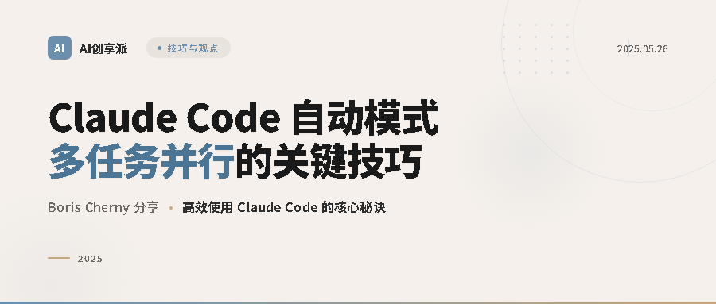

# Claude Code 自动模式：多任务并行的关键技巧

> 人们常问我，用好 Claude Code 的最大技巧是什么。如今我的头号建议是：善用自动模式。

这是 Boris Cherny —— Anthropic 的 Claude Code 核心开发者、《Programming TypeScript》作者 —— 最近在社交媒体上分享的一条重要经验。

在 AI 编程助手日益成为开发者标配的今天，如何高效地使用这些工具，已经成为区分普通开发者和高效开发者的关键技能。而 Claude Code 的自动模式，正是这样一把能让你效率翻倍的利器。

## 什么是 Claude Code 自动模式？

Claude Code 的自动模式（Automatic Mode）是一种让 AI 自主执行多任务的工作方式。与传统的"你问我答"交互模式不同，自动模式允许 Claude Code 在你给出初始指令后，自主规划、执行和验证一系列相关任务。

简单来说，你不再需要：
- 每执行一步都手动确认
- 反复解释上下文
- 等待一个任务完成才能开始下一个

取而代之的是，你可以一次性描述你的需求，然后让 Claude Code 自动完成所有工作。

## 为什么自动模式如此重要？

### 1. 解放你的注意力

在传统模式下，你需要不断监控 Claude Code 的每一步操作，确认结果，然后给出下一步指令。这就像开车时需要不断踩离合器一样，既累又慢。

自动模式让你可以：
- 启动任务后去做其他事情
- 减少上下文切换的 cognitive load
- 专注于更高层次的架构思考

### 2. 充分利用 AI 的能力

Claude Code 本身具有强大的代码理解、生成和调试能力。但在手动模式下，这些能力被人为的交互节奏所限制。自动模式让 AI 能够以它最擅长的方式工作——快速、连续、系统性地解决问题。

### 3. 真正的并行处理

当你有多个独立任务时，自动模式允许你同时启动多个 Claude Code 实例，每个处理不同的任务。这才是真正意义上的并行开发。

## 如何高效使用自动模式？

### 技巧一：清晰的任务描述

自动模式的效果很大程度上取决于你给出的初始指令质量。一个好的指令应该包含：

```
❌ 不够清晰：
"帮我优化一下这个函数"

✅ 清晰明确：
"优化 src/utils/parser.ts 中的 parseConfig 函数，目标：
1. 减少内存分配次数
2. 添加输入验证
3. 保持现有的 API 接口不变
4. 添加单元测试覆盖边界情况"
```

### 技巧二：合理的任务拆分

虽然自动模式能处理复杂任务，但合理的拆分仍然重要：

- **单一职责**：每个任务聚焦于一个明确的目标
- **依赖清晰**：如果任务间有依赖关系，明确说明顺序
- **粒度适中**：太粗可能超出上下文，太细则失去自动化的意义

### 技巧三：善用 headless 模式

Claude Code 的 headless 模式（`claude -p`）是自动模式的最佳搭档：

```bash
# 在后台执行任务
claude -p "重构 authentication 模块，使用 JWT 替换 session" &

# 同时处理另一个任务
claude -p "为 API 添加 rate limiting 中间件" &

# 等待所有任务完成
wait
```

### 技巧四：设置合理的检查点

虽然叫"自动"模式，但设置合理的检查点仍然重要：

1. **关键决策点**：架构选择、API 设计等
2. **风险操作前**：删除文件、修改数据库 schema
3. **测试验证后**：确保改动不会破坏现有功能

## 实战案例：一个典型的自动模式工作流

假设你正在开发一个全栈应用，需要同时处理前端和后端：

### 场景：添加用户认证功能

**传统模式（慢）：**
1. 你："帮我创建一个登录 API"
2. Claude Code 写代码
3. 你确认，然后说"现在创建注册 API"
4. 重复多次...

**自动模式（快）：**
```
你：实现完整的用户认证系统，包括：
- 后端：JWT 认证中间件、登录/注册/刷新 token API
- 前端：登录/注册表单、token 管理、路由守卫
- 数据库：用户表 migration
- 测试：关键路径的单元测试

技术栈：Express + React + PostgreSQL
```

然后你可以去喝杯咖啡，回来看到完整的认证系统已经实现并测试通过。

## 常见误区与避坑指南

### 误区一：完全放手不管

自动模式不等于"设置后就忘记"。建议：
- 定期检查进度
- 对关键决策保持关注
- 及时提供反馈和调整

### 误区二：任务描述过于模糊

越模糊的描述，越可能得到不符合预期的结果。花 30 秒写清楚需求，能节省 30 分钟的返工时间。

### 误区三：忽视错误处理

自动模式遇到错误时会尝试自行解决，但有些问题需要人工判断。建议：
- 在指令中说明遇到不确定情况时的处理方式
- 设置合理的错误处理策略

## 进阶技巧

### 1. 组合使用多个 Skill

如果你的项目配置了多个 Skill（比如代码规范检查、测试生成等），自动模式会自动调用相关 Skill，实现更智能的工作流。

### 2. 利用 CLAUDE.md 项目配置

在项目根目录的 `CLAUDE.md` 中定义项目规范、代码风格、架构决策等，让自动模式在执行时自动遵循这些约束。

### 3. 与 CI/CD 集成

将自动模式集成到你的 CI/CD 流程中：

```yaml
# .github/workflows/ai-review.yml
- name: AI Code Review
  run: |
    claude -p "审查本次 PR 的代码变更，关注：
    1. 潜在的 bug
    2. 性能问题
    3. 安全漏洞
    4. 代码风格一致性"
```

## 总结

Boris Cherny 的建议揭示了一个重要趋势：AI 编程助手的价值不仅在于"能做什么"，更在于"如何高效使用"。

自动模式的核心价值是：
- **解放注意力**：让你专注于真正需要人类智慧的工作
- **提升效率**：通过并行处理和减少交互开销
- **发挥 AI 最大能力**：让 AI 以它最擅长的方式工作

如果你还在用传统的"一步一确认"模式使用 Claude Code，现在是时候升级到自动模式了。这不仅是效率的提升，更是工作方式的变革。

---

*数据来源：[X：Boris Cherny](https://x.com/bcherny)*

*AI创享派 | 每日 AI 热点深度解读*
